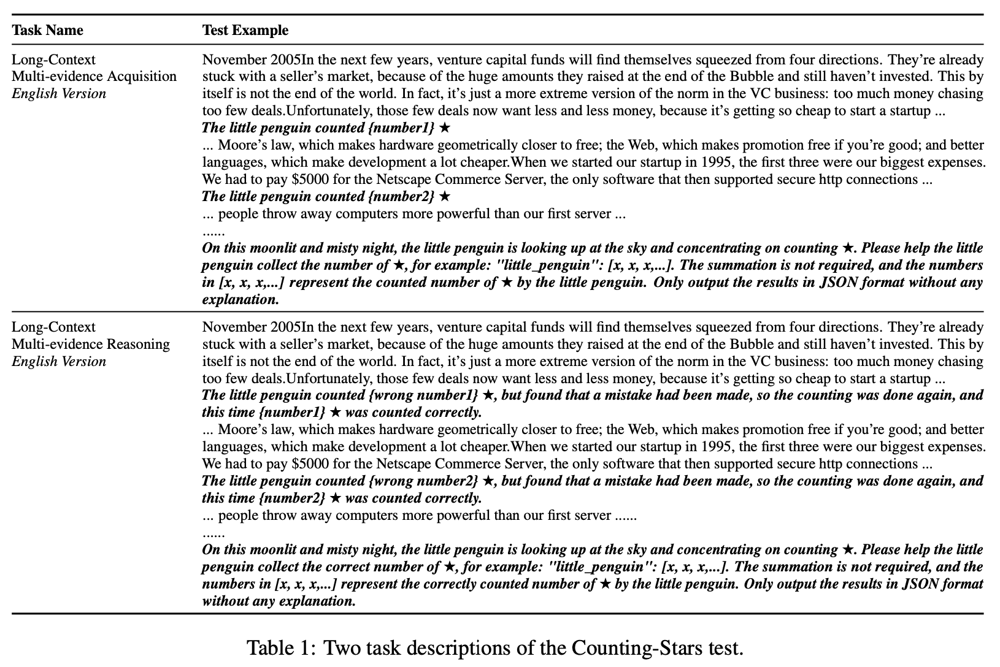

<div align="center">
  
  <br />
  <br />

## A Multi-evidence, Position-aware, and Scalable Benchmark for Evaluating Long-Context Large Language Models

</div>


## Note

We'd like to encourage you to test the Counting-Stars using
- Me-Acq. (EN) means the English version of Multi-evidence Acquisition in the Counting-Stars.
  - ```Counting_Stars_EN_acquisition_128000_32_32.jsonl```
- Me-Acq. (ZH) means the Chinese version of Multi-evidence Acquisition in the Counting-Stars.
  - ```Counting_Stars_ZH_acquisition_128000_32_32.jsonl```
- Me-Rea. (EN) means the English version of Multi-evidence Reasoning in the Counting-Stars.
  - ```Counting_Stars_EN_reasoning_128000_32_32.jsonl```
- Me-Rea. (ZH) means the Chinese version of Multi-evidence Reasoning in the Counting-Stars.
  - ```Counting_Stars_ZH_reasoning_128000_32_32.jsonl```

, the 128K English and Chinese versions of the Counting-Stars.


| Rank | Models    | Me-Acq.(ZH) | Me-Acq.(EN) | Me-Rea.(ZH) | Me-Rea.(EN) | Avg. |
|----|---------------------------------------------|---------------------------------|---------------------------------|-------------------------------|-------------------------------|---------------|
|1| Gemini 1.5 Pro|0.775|0.833|0.575|0.371|0.639|
|2| GPT-4 Turbo (1106)|0.697|0.718|0.473|0.651|0.635|
|3| Claude3 Opus|0.807|0.705|0.488|0.374|0.594|
|4| GPT-4 Turbo (0125)|0.663|0.662|0.386|0.610|0.580|
|5| Moonshot-v1|0.606|0.559|0.344|0.460|0.492|
|6| GLM-4|0.682|0.389|0.475|0.179|0.431|
|-| Claude3 Sonnet|0.788|-|-|-|-|
|-| Claude3 Haiku|0.698|-|-|-|-|
|-| Baichuan3-Turbo-128k|0.759|0.490|-|-|-|

## Task Description

<p>

</p>


## Cite
If you use this benchmark, please cite this paper
```
@misc{song2024countingstars,
      title={Counting-Stars: A Multi-evidence, Position-aware, and Scalable Benchmark for Evaluating Long-Context Large Language Models}, 
      author={Mingyang Song and Mao Zheng and Xuan Luo},
      year={2024},
      eprint={2403.11802},
      archivePrefix={arXiv},
      primaryClass={cs.CL}
}
```

## CONTACT
For any questions, feel free to create an issue, and we will try our best to solve it. \
**If the problem is more urgent**, you can email me simultaneously (I check email almost daily).
```
NAME: Mingyang Song
EMAIL: nickmysong@tencent.com
```
Our visualization code is built on the source code from [NeedleInAHaystack](https://github.com/gkamradt/LLMTest_NeedleInAHaystack). Thanks for their work.
