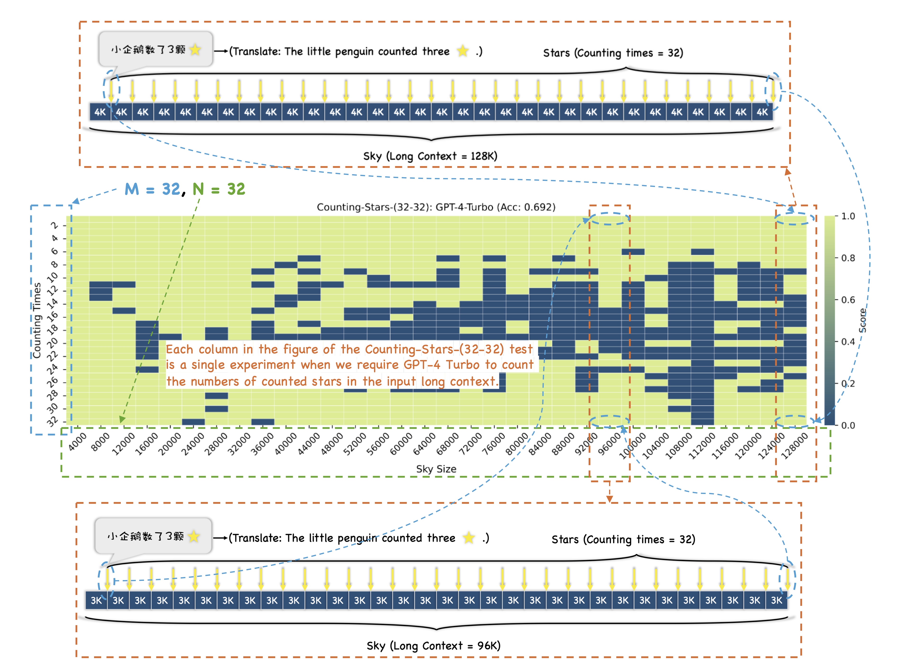
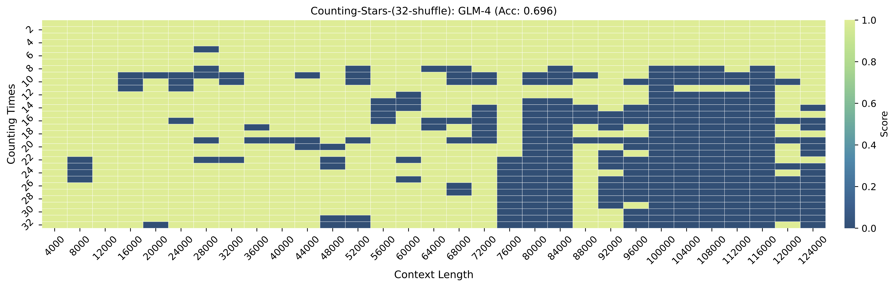

<div align="center">
  
  <br />
  <br />

## A Multi-evidence, Position-aware, and Scalable Benchmark for Evaluating Long-Context Large Language Models

<p align="center">
  <a href="./README_ZH.md">中文</a> •
  <a href="./README.md">English</a> •
  <a href="https://arxiv.org/pdf/2403.11802v2.pdf">Paper</a>
</p>

</div>

<p align="center">

</p>

## Note

We'd like to encourage you to test the Counting-Stars using
- Counting_Stars_128000_32_32.jsonl
- Counting_Stars_256000_32_32.jsonl

, the standard version of the Counting-Stars. Notably, only testing the first one is enough because the second is more difficult than the first one.
The figure above may help you understand the idea of the Counting-Stars, including the meaning of the parameters **M** and **N**.

#### 2024.04.26

通过大量实验发现，如果星星数量是递增的，或者有明显规律的，会导致测试结果不准确（大模型可能胡言乱语，乱造结果），因此将实验的基础版本改为星星数量是随机递增生成，然后打乱，具体测试数据已经更新在```test_data```中，包含两个版本，128K和256K的。
- ```Counting_Stars_128000_32_32.jsonl```
- ```Counting_Stars_256000_32_32.jsonl```

#### 2024.04.24

文章还在继续增加实验和改进的阶段，后续会有各种各样的更新，期待与有想法的人一起讨论！

关于中文测试，我们已经将带有描述数星星的句子扩充到1024条（即M=[32,64,128,256,512,1024]），并构建了随机打乱的星星数量，可以支持对1M长文的测试。

同时，补充GLM-4（glm-4）在中文数星星上的实验（星星数量是打乱的）：

<p align="center">

</p>

GLM-4的temperature参数无法设置成0，因此在实验时，直接采用默认参数。

#### 2024.03.28

补充介绍：

我们设计数星星的时候，为了保证可扩展性，引入了两个参数，即M和N。具体而言，M代表了数星星的次数，N代表了对上下文长度划分的不同粒度。M可以理解为大海捞针中的文档深度（document depth），N可以理解为大海捞针中的上下文长度（context length）。
进一步，其实，M可以对应论文中展示图例中的纵轴，N可以对应横轴，可以用下面Highlight部分中的图作为参考，即Counting-Stars-(32-32)的版本。
- **N=32**, sky size (context length) = [4000, 8000, 12000, 16000, 20000, 24000, 28000, 32000, 36000, 40000, 44000, 48000, 52000, 56000, 60000, 64000, 68000, 72000, 76000, 80000, 84000, 88000, 92000, 96000, 100000, 104000, 108000, 112000, 116000, 120000, 124000, 128000]
- **N=16**, sky size (context length) = [8000, 16000, 24000, 32000, 40000, 48000, 56000, 64000, 72000, 80000, 88000, 96000, 104000, 112000, 120000, 128000]

上述是将128K作为测试的最大上下文长度。当然，相比N=32，N=16是更为简单的版本。

此外，构建不同的N，还有两个原因：
- 通过实验，我们发现模型在100K可能表现很好，即数星星获得满分，但是96K或者更短的上下文上是差的，这点论文中有说明。
- 通过控制N的大小，进而控制数星星任务的难度。

近期，收到email咨询数星星细节的相关问题，由于相关实验和论文写作完成的比较急促（**自2024.3.7开始构思数星星并着手实验，2024.3.16-17完成论文[v1](https://arxiv.org/abs/2403.11802v1)，2024.3.23-24完成论文[v2](https://arxiv.org/abs/2403.11802v2)，期间还在审稿ACL等会议文章，因此导致论文中有些介绍可能不充分**），在此补充一些介绍，之后有时间我们将会修改和补充论文中有歧义的部分。


#### 2024.03.27

- [大海捞多针补充介绍](supplementary/README.md)

<!-- [The supplementary information about NeedleInAHaystack is available in Chinese.](fig/README.md) -->

#### 2024.03.25

- We promptly corrected some mistakes in the visualization code and updated all the figures in the paper and this repository.

- Additionally, we updated the prompts used in the English version, making the corresponding figure in the paper look better.

## Highlight

#### 2024.03.31

**数星星**期望：
- 在上下文中引入更多需要收集的证据，而且可以简单调整证据的数量等。
- 确保大模型在回答问题时需要进行一定的推理，尤其是涉及多证据的推理。
- 促使大模型可以将答案汇总成JSON格式，并输出一个整体的结果。

#### 2024.03.26

- 我们发现大模型很喜欢偷懒，如果星星数量是递增的，那么即使根据区间随机生成数量，对大模型来说也是更为敏感的信息。因此，我们首先生成递增数列，然后打乱再插入上下文中，原始数列和打乱数列如下：
- **Original**: [3, 5, 9, 15, 19, 21, 26, 29, 35, 38, 42, 46, 49, 54, 58, 61, 66, 69, 74, 77, 81, 86, 89, 94, 97, 102, 107, 109, 113, 117, 122, 127]
- **Shuffled**: [15, 117, 42, 69, 58, 107, 9, 49, 113, 66, 26, 102, 81, 94, 77, 61, 5, 19, 109, 3, 35, 54, 86, 89, 127, 21, 46, 122, 38, 97, 74, 29]
- GPT4和KIMI的测试结果如下图。

<p align="center">

</p>

- 综上，我们认为打乱顺序可以作为一个更难的版本（这个实验在论文中已增加）。

## CONTACT
For any questions, feel free to create an issue, and we will try our best to solve it. \
**If the problem is more urgent**, you can email me simultaneously (I check email almost daily).
```
NAME: Mingyang Song
EMAIL: nickmysong@tencent.com
```
Our visualization code is built on the source code from [NeedleInAHaystack](https://github.com/gkamradt/LLMTest_NeedleInAHaystack). Thanks for their work.
