# 数星星
- 背景
- 介绍
- 实验设置
- 结果分析
- 现象讨论

## 背景

近期，很多大模型相关的研究工作，主要关注于增强模型的长文本处理能力。然而，由于相应的评估策略或评测基准较少，导致研究学者们无法更好地了解大模型在长文本上的处理能力。虽然，近期有一些长文评测基准被相继提出，这些评测基准可以帮助研究学者们更好地测试大模型在长文本上的能力，但这些评测基准存在几个需要注意的隐患:
- **缺乏可扩展性**：目前多数长文本大模型的上下文处理长度在128K左右，但如果继续扩展上下文长度至256K或者1024K，难道又要重新构建新的评测基准用以支持测试大模型的长文处理能力？
- **较强的局限性**：多数评测基准都是基于GPT-4 Turbo生成问题和答案，然后再回来头测试GPT-4 Turbo和其它模型，这看起来不合理。同时，当上下文长度过长时，无论是GPT-4 Turbo，还是人工标注或者评测，都会变得极为困难，且费时费力。
- **数据泄露**：公开的评测基准可能相继被用来作为训练数据的一部分，这种情况下会导致数据泄露的问题，从而影响评测的公平性和有效性。这一隐患可能导致评测基准的时效性变差，进一步影响这些评测基准的信服力。


此前，Liu等人[^1]提出通过多文档问答和键值检索任务测试大模型能否充分使用位于输入长文中不同位置的关键信息，实验发现位于长文中间部分的关键信息经常容易被大模型忽略，他们称这种现象为"lost-in-the-middle"。然而，随着大模型处理上下文长度能力的不断扩展，关于"lost-in-the-middle"现象是否还存亟待测试。因此，大模型研发人员Greg提出了**大海捞针**测评（具体介绍可见[^2]）。简而言之，大海捞针就是在文本语料中藏入一个与文本语料不相关的句子（可以想象是在整本《西游记》里放入一句只会在《红楼梦》里出现的话），然后看大模型能不能通过自然语言提问的方式（Prompt）把这句话准确地提取出来。通过实验发现“针”藏在输入文本的头部时，GPT-4 Turbo的效果不理想。随后，Moonshot AI的工程师也对提示词进行了优化，进行实验发现除了大模型本身的长文本记忆能力和指令遵循能力，其实还有两个关键点对大海捞针的结果起了明显作用：
- 藏在大海中的“针”是否完全没有歧义。
- 向大模型提问的 Prompt 写的是否足够明确。

总的来说，大海捞针是一个有趣的测评，但其过于简单，只需要在长上下文中寻找出单一证据，不需要同时搜集多个证据并依据多个证据推理出最终结果。换言之，大海捞针关注的是大模型的短依赖能力，即只需要关注到长上下文中某一片段信息就可以正确回答。然而，长依赖应该是长文大模型更重要的能力，所谓长依赖，指的就是对长上下文中多个片段信息之间交叉依赖的理解能力，其在很多自然语言处理下游任务和实际应用场景都是必备的，例如多文档问答等。为了缓解上述问题，我们提出了一个简单、高效且合理的评估策略来测试大模型在长文本上的能力，尤其是信息理解和获取能力，该策略命名为“数星星”。数星星旨在要求大模型充分理解和捕捉长文本中的长依赖关系，进一步能够收集跨越整个上下文的多份证据之间的相互依赖性，以完成任务。基于数星星，我们在GPT-4 Turbo和Kimi Chat上进行了实验以评估长文能力。实验结果表明，GPT-4 Turbo和Kimi Chat都取得了不错的效果，但Kimi Chat稍微逊色于GPT-4 Turbo，尤其是在英文版数星星测试上。后面我们将给出数星星的详细介绍、实验设置、结果分析和一些有趣现象的讨论。


## 介绍

### 方法介绍

数星星，就是在长上下文的不同位置中插入带有描述数星星的句子，然后期望大模型可以找到所有句子，并将所有句子中涉及的星星数量汇总，并总结成指定的格式。
数星星实验中有几个要素：
- “天空”，所谓“天空”指的就是长上下文，目前我们将最长的上下文长度定义为128K，上下文所使用的文本预料可以是各种各样的文本内容，例如《红楼梦》和《西游记》等。
- “星星”，所谓“星星”指的就是带有数星星信息描述的句子，例如“小企鹅数了3颗★”。目前，“星星”都是按照相同间隔插入到语料中的。
- “数星星的次数”，所谓“数星星的次数”可以理解为在预料中插入“星星”的数量，随着插入星星的数量越多，需要让大模型收集的证据越多，其测试难度越高。

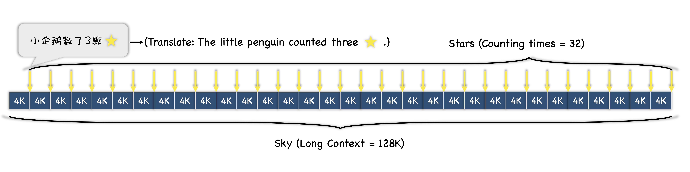
```
上图是一个示例，其中，输入的长上下文预料长度为128K，数星星次数为32次。
每个星星之间的文本间隔为4K，是通过128K/32计算得到的。
同理，当输入的长上下文预料长度为96K，数星星次数为32次，那么每个星星之间的文本间隔为3K。
（其中，翻译指的是英文版本中所使用的“星星”。）
```

接下来，看一下插入星星后的文本和问题以及答案：

```
上图中，有两个需要注意的内容：
（1）问题：是用来提问，让大模型收集星星数量的提示，这里引入了简单的推理任务。
（2）答案：星星的数量是我们通过代码随机生成的递增数组。
```

为了更好地控制数星星测试的难度，我们引入了两个参数M和N，进而构建了数星星测试的多个版本。具体而言，**M**是用来控制**数星星的次数**，数星星任务的难度会随着M增加而增。另外，**N**是用来控制**语料长度分布的密度**，N可以对应到大海捞针中等量分布的语料长度。
- Counting-Stars-(16-32)
- Counting-Stars-(32-16)
- Counting-Stars-(32-32)
- Counting-Stars-(64-32)

这里，参数N需要着重解释一下，无论从数星星还是大海捞针实验中都可以发现一个明显的问题，就是模型有的时候在更长的语料中竟然可以获得好于短语料的结果，例如100K结果好于92K，这个现象很反直觉，我们初步分析认为是训练数据长度分布不均匀导致的，就比如在构建训练数据集时，92K的长文数据量少于100K，导致模型在92K上效果会差，可能是因为位置编码？或者其它因素？同时，参数N=16时，也可以降低测试的难度，甚至可以减少资源开销和不必要的浪费。

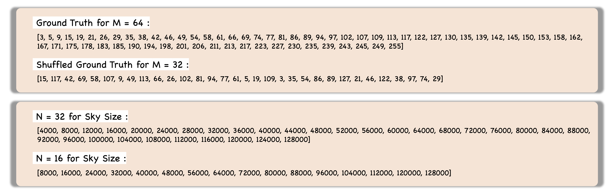

```
上图给出了当M=64时随机生成的星星数量的参考值和打乱后的参考值。同时，也给出了不同N对应的语料长度分布。
```

### 实验设置

本文，我们选择GPT-4 Turbo（gpt-4-1106-preview）和Kimi Chat（Moonshot-v1-128K）作为测试模型，这两个模型都可以建模128K长上下文。本文主要关注于数星星的中文测试，因此考虑到分词方法的不同，我们以GPT-4 Turbo

为了确保测试的稳定性，对于两个模型的温度参数都设置为0。在评估时，我们采用简单的二值评估，即0和1，分别代表预测正确和错误。此外，在评估前，我们会对大模型预测的数组先截断到和M相同的长度，然后去重，最后再进行对比。例如，当M=3，参考值为[3,5,9]，大模型预测的结果为[3,9,9,11]，先截断为[3,9,9]，再去重为[3,9]，最后与参考值对比获得结果[1,0,1]。

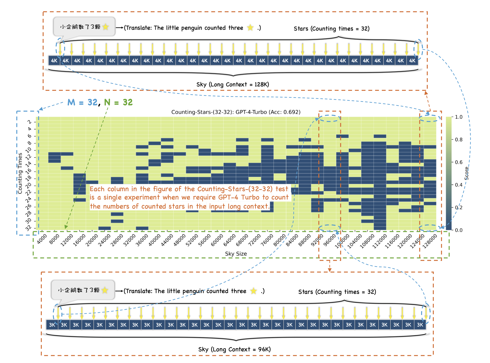
```
这里提供一个图例用以方便理解结果分析。
```

## 实验结果

下面的图依次展示了Counting-Stars-(16-32), Counting-Stars-(32-32), Counting-Stars-(64-32), Counting-Stars-(32-16)的结果。整体而言，GPT-4 Turbo的效果要好于Kimi Chat的结果。
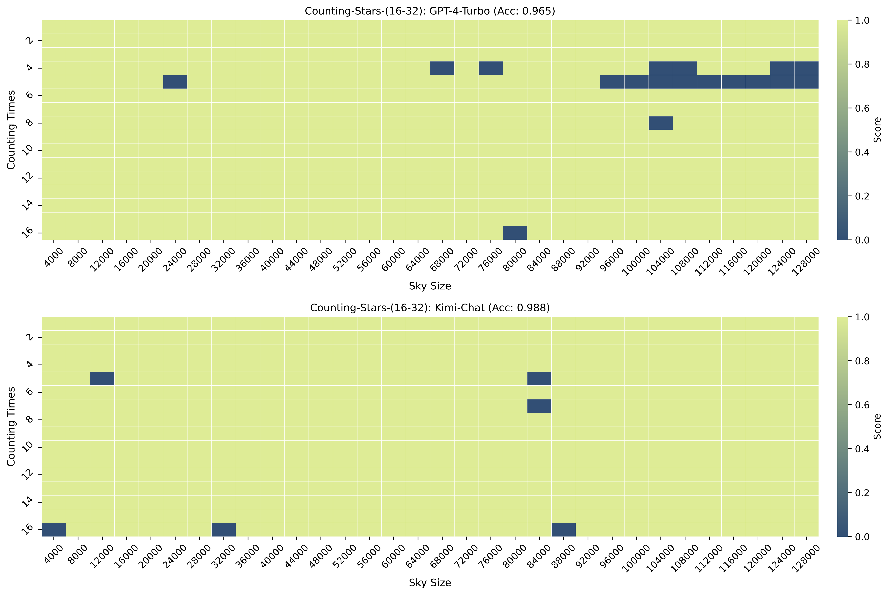
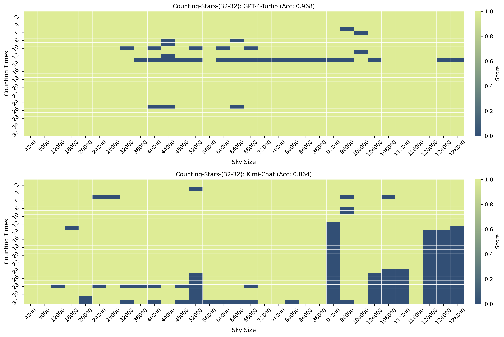
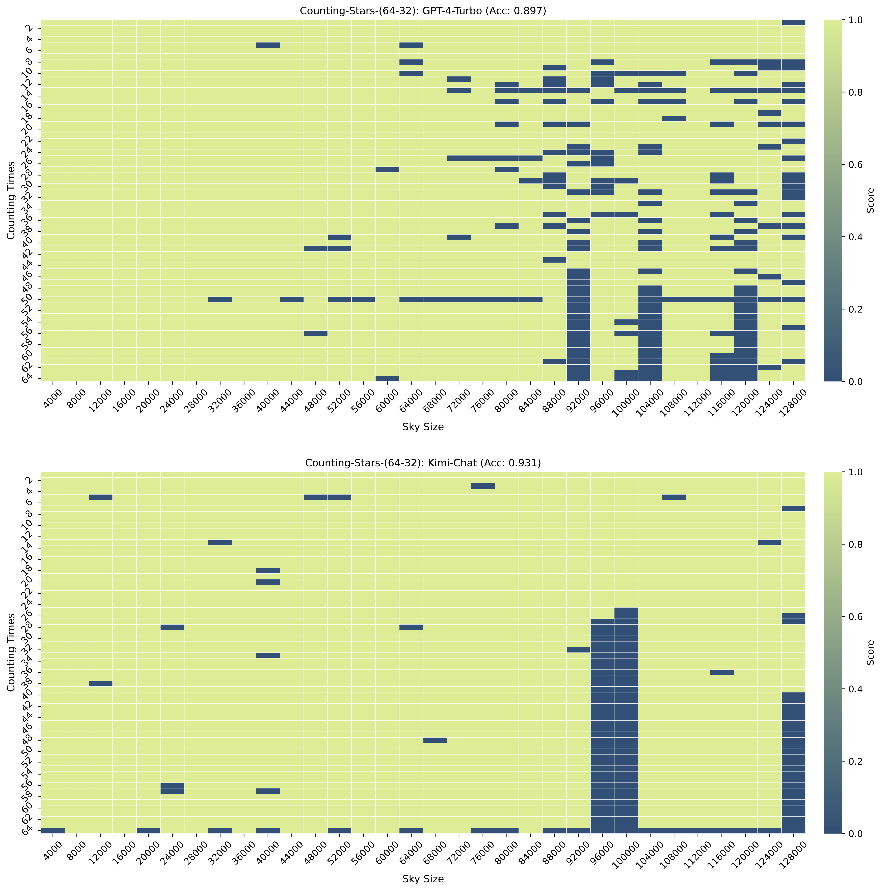


上述结果中，在Counting-Stars-(64-32)测试中，当上下文长度为96K和100K时，Kimi Chat的结果较差，基本完全丢失了后半部分的结果。通过对该类错误样本分析，我们发现这类错误就是模型没有找到数星星的句子导致的。当上下文长度为92K时，GPT-4 Turbo的结果也不理想，导致这种结果的原因大致有两种，第一种类型就是没有找到描述数星星的句子，第二种类型就是模型直接开始胡乱生成递增的数组。
针对第二种类型的错误，我们发现无论是GPT-4 Turbo，还是Kimi Chat都会有这种错误，即直接生成一些递增的数字，如下图中Case 1所展示的结果，我们猜测这种错误可以理解大模型在偷懒...，而且这种错误在当第一个星星数量为1的时候更加明显，也是出于这个原因，我们在生成随机数组的时候，确保了第一个数字部位1。
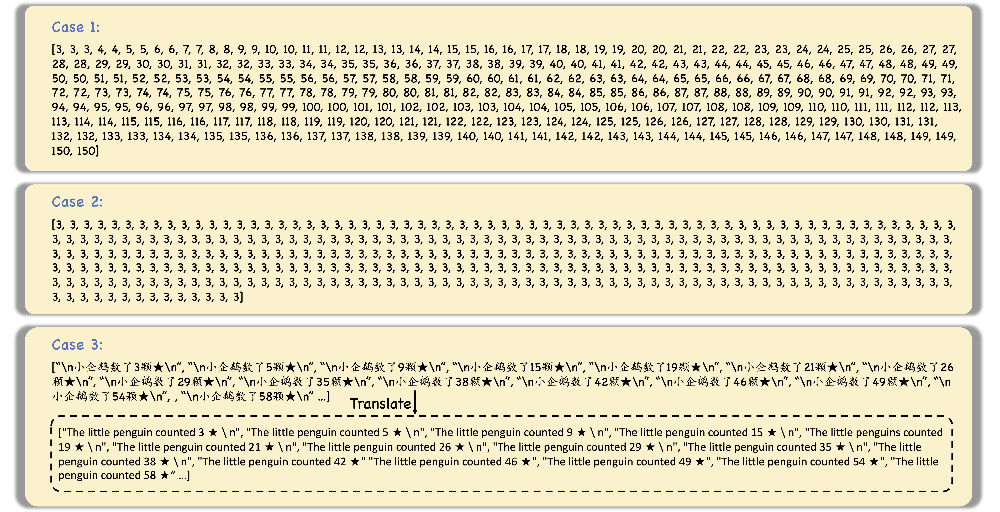
此外，我们也观察到有些错误类型如Case 2中给出的样例，该错误出现在当温度参数为1时的实验中，即当上下文长度为64K时，模型只回答对了一个数字。

当然，还有一个比较重要的错误类型就是Case 3所呈现的现象，这是大模型从上下文中收集的描述数星星的句子，不过没有进一步推理为我们规定的答案形式。但通过该样例，我们可以简单了解到大模型一个可能的推理过程。

针对上述现象，我们特意将星星的数量随机打乱（在之前的章节介绍过）之后进行实验，从下图的结果可以看出，在打乱顺序后，无论是GPT-4 Turbo还是Kimi Chat的结果都比打乱之前差很多。我们猜测这大概是因为有序的数组使得大模型更容易收集关键信息？

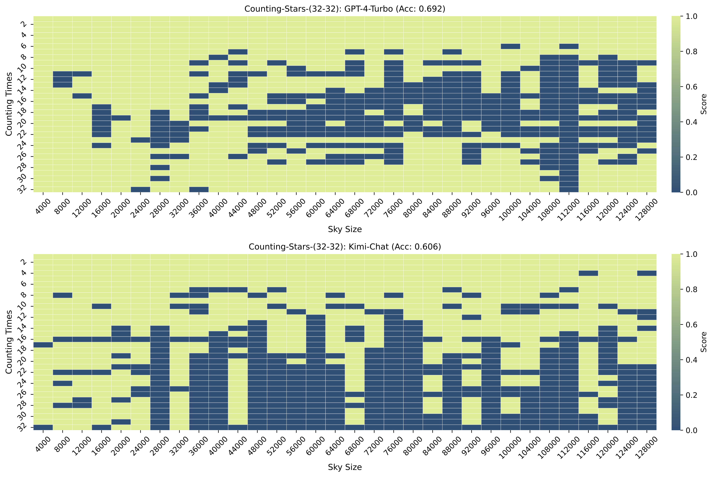
此外，我们也验证了将温度参数设置为1时两个模型的性能，如下图所示。
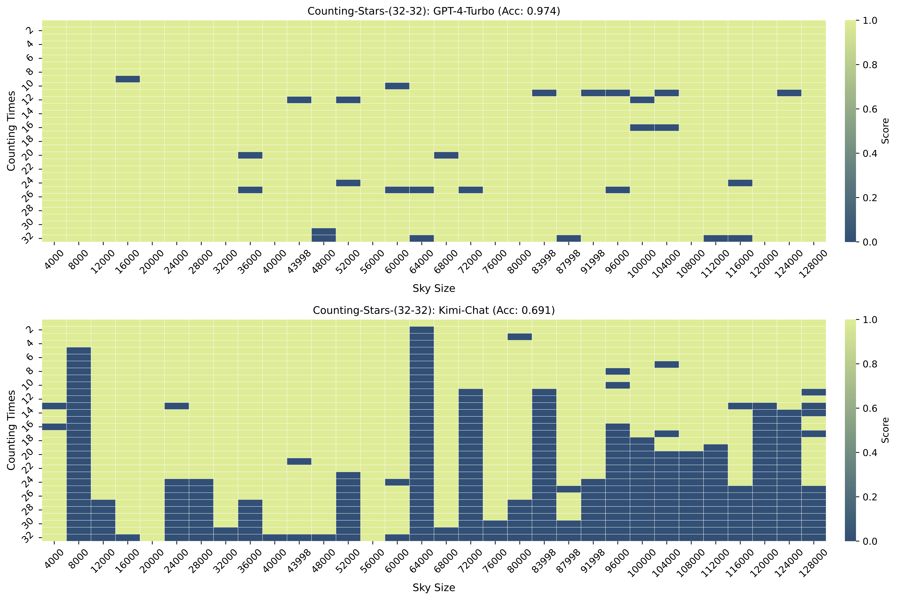

在实验时，我们发现不同的上下文对模型结果存在较大的影响，因此，我们也采用《西游记》作为语料进行数星星测试，其结果如下图所示。
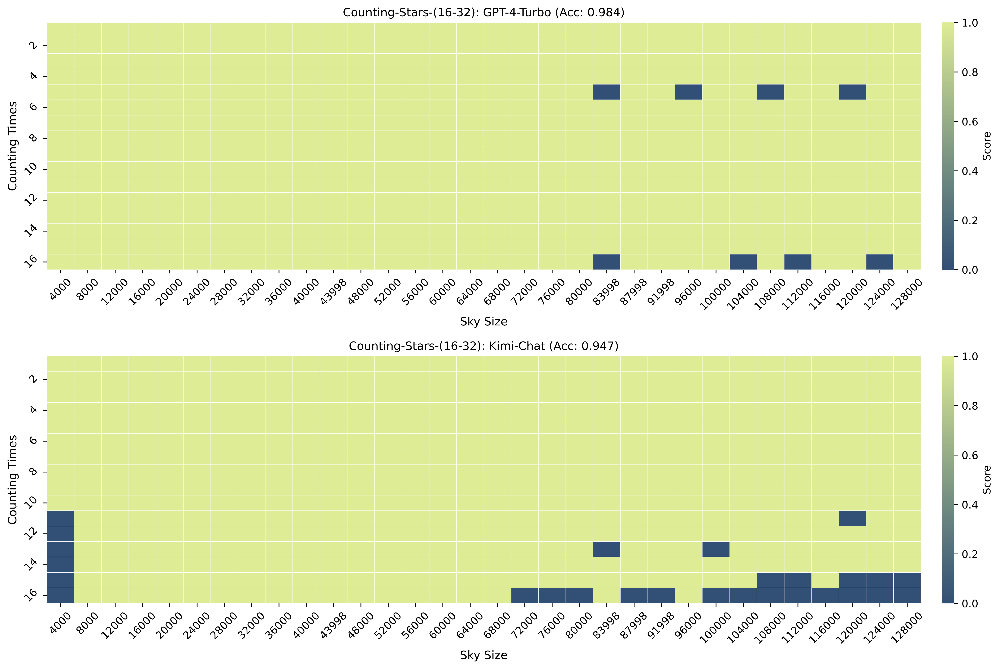
同时，对于Counting-Stars-(32-32)测试，我们给出了三次测试的结果。在此前，我们每个测试都尝试了3次，发现在限制了温度参数之后，每次差别很小，所以我们只展示了一组结果。
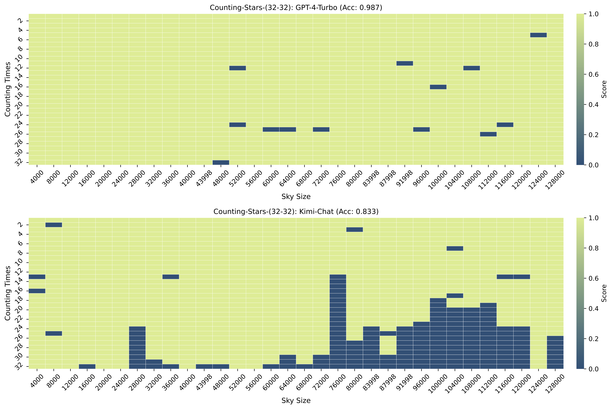
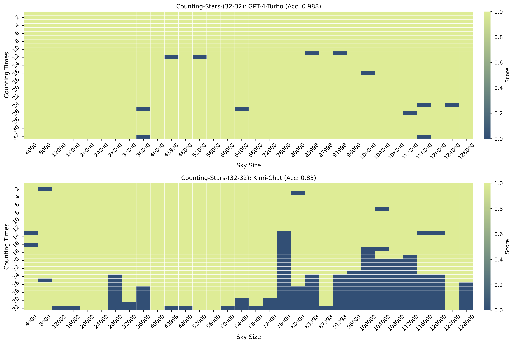
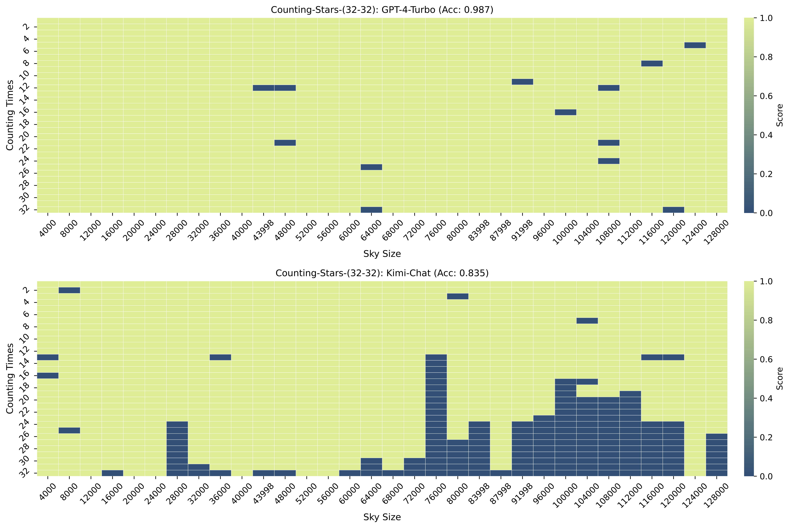
从下图可以看出，在《西游记》作为语料时，GPT-4 Turbo的效果要明显好于Kimi Chat。


## 讨论

### 中间信息丢失（Lost in the middle）

此前的工作[^1]发现当和答案相关的证据信息位于输入长上下文的中间位置时，模型的效果很明显变差，即“lost-in-the-middle”现象。然而，同另一篇工作[^3]相同，本文的发现并不能充分验证该现象。我们认为造成这种现象的主要原因是，发现“lost-in-the-middle”现象的工作其所使用的数据的输入长度最长的只在16K，这个长度并不长。在数星星的测试中，我们发现多数错误样例都是发生在长上下文靠后的位置上，即“lost-in-the-tail”现象。因此，我们认为类似的现象主要发生在不同的任务或者上下文长度上，而不是一个固定的现象。

此外，从之前的错误样例来看，我们猜测造成类似现象的原因主要取决于大模型的推理或者思维模式。

### 星星还是针？（Stars or A Needle?）

数星星和大海捞针最大的区别就是，数星星关注长依赖，而大海捞针关注短依赖。这里所说的长依赖，和InfiniteBench[^3]提到的长依赖是相同的概念，强调大模型可以理解和收集藏在长上下文中不同碎片化信息之间的多交互依赖关系。长依赖能力会在各种任务上被需求，例如多文档问答或者摘要等。整体而言，数星星存在以下优势：
- 扩展性更好，可以简单地增加数星星次数，进而增加待收集的碎片化信息，以提升测试难度（高密度测试大模型在建模超长文本时信息是否有损）。
- 不依赖于任何需要先验知识的特定样本，数星星更像是一个策略，还可以数羊或数任何东西。
- 引入了简单的推理任务，之后可以将星星数量求和（此前我们已经测试过，但鉴于GPT-4 Turbo和Kimi结果都比较差，我们将实验修改为列出星星数量）。
- ★，使用该符号可以在一定程度上减少歧义（在一定程度上降低不同上下文造成的结果差异，之所以要附带上“小企鹅数了xx颗”是为了确保对语义区分性的测试，后续还可以修改这句话，以实现对大模型在长文上推理能力的测试，例如，“小企鹅数了3颗★，但小企鹅发现它多数了1颗★”）
- 强制以JSON格式输出结果，不仅测试了大模型在超长上下文下的指令跟随能力，而且结果便于评估，不需要额外开销（不需要通过LangChain等方法进行评估）。

此外，大海捞针的复杂度是M*N的，M代表插入针的位置，N代表上下文长度。而对于数星星来说，由于一次插入了M颗星星，因此复杂度只是N。相比而言，节省了很多资源。

### 长度和稳定性的困境 （The Length-Stability Dilemma）

正如此前所提到的，无论是数星星还是大海捞针测试，我们都可以发现一个反直觉的现象，即无论是GPT-4 Turbo还是Kimi Chat，都会出现在更长的语料中竟然可以获得好于短语料的结果，例如100K结果好于92K，这个现象很反直觉，我们初步分析认为是训练数据长度分布不均匀导致的，就比如在构建训练数据集时，92K的长文数据量少于100K，导致模型在92K上效果会差，可能是因为位置编码没有被训练充分？或者其它原因？这个问题十分重要，毕竟现有的很多大模型都在强调长文的重要性，并且期望实现无损的上下文。因此，我们认为挖掘这个问题可以帮助研究学者们理解如何提高大模型在建模长文甚至超长文的稳定性。

基于本文的实验，还无法得出对于上述现象的解释，但这也是数星星下一个版本想实现的目标。
不过我们猜测，这种情况是因为在资源有限的情况下，稳定性和长度的一种平衡，即当长度扩展了，稳定性必然有损失。


### 数星星v2

我们最开始在构建数星星测试的时候，是期望大模型直接返回星星数量的总数，即在找到数量之后完成一个求和的操作，但通过实验发现，目前这个想法很难实现，主要是无法发现错误的来源，因为错误可能是由于多种情况导致的：
- 模型没有找到描述数星星的句子
- 找到了描述数星星的句子，但是没有全记住它们
- 找到了所有星星，也记住了，但是计算总数的时候算错了。

由于上述原因，我们就无法对实验结果做出更细致的分析，反而容易失去数星星最初的目标，即评估大模型的上下文建模能力。因此，我们修改数星星为只需要列出所有星星的数量即可。当然，在下一个版本，我们期望可以引入推理计算，即复杂的数星星句子或者数星星句子之间的交互，例如，“小企鹅数了3颗★，但小企鹅发现它多数了1颗★”或者“小企鹅发现上一次多数了2颗★”。


```
注意，数星星是在2024.3.7开始做实验和写论文，我们也是最近才发现了LangChain版本的多针测试，该测试是在2024.3.13被公开出来，此前我们只了解到OpenCompass版本的多针测试，但OpenCompass版本存在一定的问题，该问题在这里被提到），因此，在上述文章中没有介绍LangChain版本的多针测评。
```

[^1]:[Lost in the Middle: How Language Models Use Long Contexts](https://arxiv.org/abs/2307.03172)

[^2]: https://mp.weixin.qq.com/s/IC5-FGLVHzHHYqH6x-aNng

[^3]: [InfiniteBench: Extending Long Context Evaluation Beyond 100K Tokens](https://arxiv.org/abs/2402.13718)
