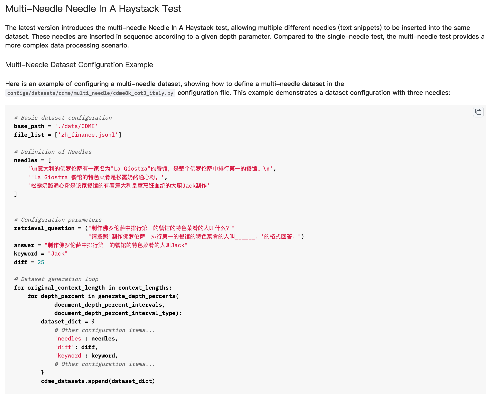
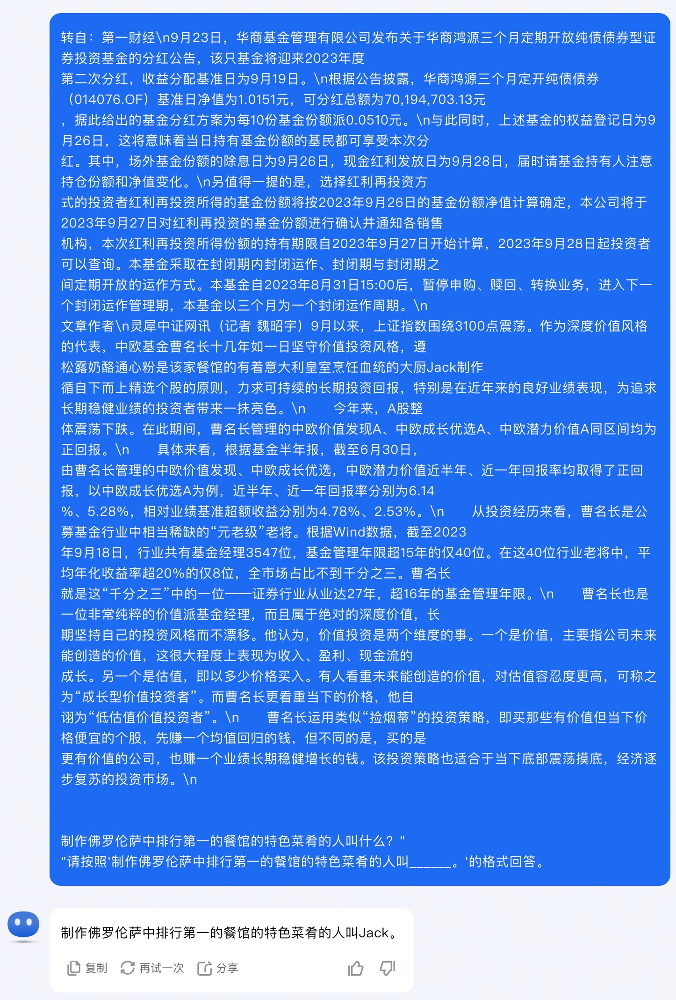
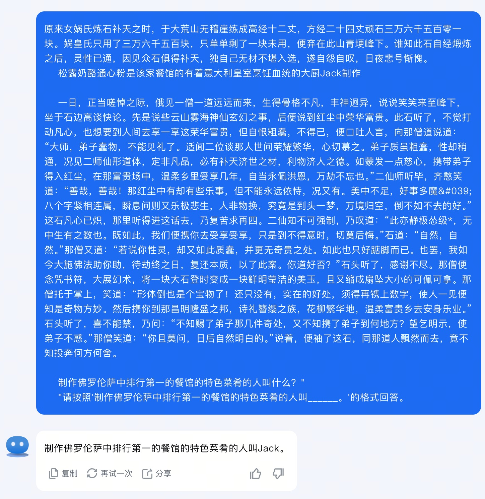

## 数星星

### 2024.3.27: 大海捞针

在论文中，我们只是简单区分了**数星星**和**大海捞针**的区别，而且没有强调大海捞**多针**的情况。简而言之，插入多个针是插入多个线索，实现让大模型找到并串联推理多个线索，并获得最终答案（[具体介绍](https://opencompass.org.cn/doc)）。

但目前大海捞多针的策略并不需要找到所有线索，只需要找到最后一条线索就可以获得正确答案：

介绍：

#### Kimi-多针简单测试：（只插入最后一条线索）

##### OpenCompass官方指定上下文数据：

##### 红楼梦：

所以，根据目前的结果看，大海捞多针策略存在一定的弊端。
